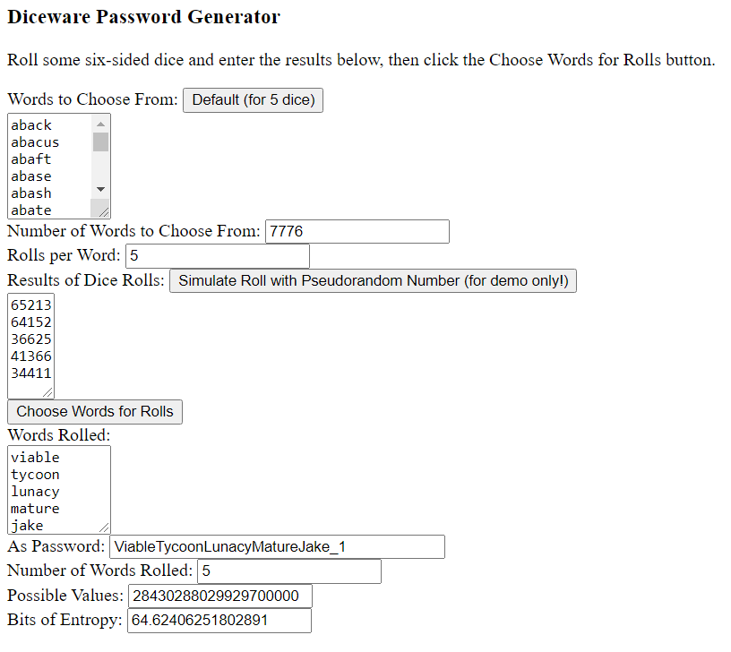

Diceware Password Generator
===========================

The JavaScript code in this repository, when run, allows the user to specify a word list and the results of multiple random dice rolls, and generates a password based on those rolls.

To see it in action, open the file DicewarePasswordGenerator.html in a web browser that runs JavaScript.

